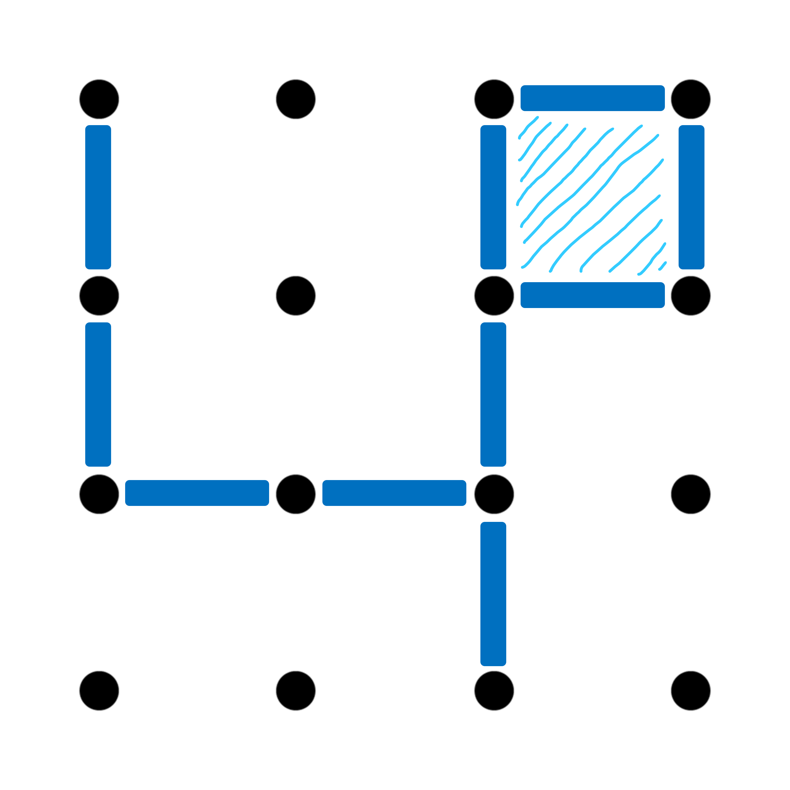

# **Projeto Nº 2:** Época Normal

<hr/>



<hr/>

**Unidade Curricular: Inteligência Artificial**
* **Professor**:
    * Eng. Filipe Mariano

* **Alunos**:

  * João Portas - 202002475
  * Lucas Freixieiro - 202002193

<br>

# Introdução

Este programa foi elaborado para a unidade curricular de inteligência artificial e tem o propósito de colocar em pratica o aprendido durante as aulas.
Este programa tem como objetivo simular o jogo Dots and Boxes, havendo então 2 modos de jogo, CPU vs Humano e CPU vs CPU.
As jogadas do CPU são feitas com base no algoritmo alfabeta.
O algoritmo alfabeta vai permitir ao CPU avaliar as suas jogadas e tentar assim decidir a que vai ter melhor resultados.

<br>

# Instalação e utilização

Para o desenvolvimento foi utilizado o SBCL com a consola do VSCode.
Se tiver o SBCL instalado é possível correr o projeto com:

```console
sbcl --load .\jogo.lisp --eval '(in-package #:jogo)'
```

para executar o programa no geral e poder utilizar funções na consola.
De seguida basta escrever `(start)` na consola e temos o programa a correr.

<br>

# Input/Output

Com o programa a correr o utilizador vai ter de inserir na consola o modo de jogo (usando valores numéricos).

O ficheiro `log.dat` serve para monitorizar as jogadas e o estado do jogo.
Este ficheiro vai conter os seguintes atributos:
 - Jogada realizada (i.e. (3 1 arco-horizontal))
 - O novo estado
 - Número de nós analisados
 - Número de cortes efetuados (de cada tipo)
 - Tempo gasto

<br>

# Exemplo de aplicação

Após executar `(start)` irá aparecer o seguinte ecrã:

```console
Welcome to IA 0.1 :)
Qual a posição do problema?
```

O utilizador deve introduzir a posição do problema (número).

Caso não exista nenhum problema nessa posição é novamente pedido ao utilizador a posição.

```console
Essa posição não existe
Qual a posição do problema?
```

O mesmo acontece caso o utilizador use letras em vez de números.

De seguida é pedido o algoritmo de procura:

```console
Que algoritmo quer usar para procurar? 
1- Procura na largura
2- Procura na profundidade
3- A*
```

*Nota* caso o valor seja maior que o permitido é assumido a última opção. Caso não seja um número é pedido outra vez uma opção.

Depois de escolhido o algoritmo o programa pede a profundidade caso seja **Procura em profundidade** e caso seja o **A Estrela**

```console
Qual a profundidade limite?
```

Por fim é mostrado o resultado e estatísticas de desempenho da busca com o algoritmo escolhido e essa busca é gravada no ficheiro `desempenho.dat`

```console
Board: (((0 0 0) (0 0 1) (0 1 1) (0 0 1)) ((0 0 0) (0 1 0) (0 0 1) (0 1 1)))
Objetivo:4
Algoritmo: DFS
Profundidade: 5
Resultado da procura: ((((1 0 0) (0 1 1) (0 1 1) (0 1 1))
                        ((0 0 0) (0 1 1) (0 1 1) (0 1 1)))
                       5
                       ((((1 0 0) (0 1 1) (0 1 1) (0 1 1))
                         ((0 0 0) (0 1 1) (0 0 1) (0 1 1)))
                        4
                        ((((1 0 0) (0 1 1) (0 1 1) (0 1 1))
                          ((0 0 0) (0 1 0) (0 0 1) (0 1 1)))
                         3
                         ((((1 0 0) (0 1 1) (0 1 1) (0 0 1))
                           ((0 0 0) (0 1 0) (0 0 1) (0 1 1)))
                          2
                          ((((1 0 0) (0 0 1) (0 1 1) (0 0 1))
                            ((0 0 0) (0 1 0) (0 0 1) (0 1 1)))
                           1
                           ((((0 0 0) (0 0 1) (0 1 1) (0 0 1))
                             ((0 0 0) (0 1 0) (0 0 1) (0 1 1)))
                            0 NIL))))))
Total de nós gerados: 3741
Total de nós expandidos: 307
Ramificação: 3729/307
Tabuleiro solução: (((1 0 0) (0 1 1) (0 1 1) (0 1 1))
                    ((0 0 0) (0 1 1) (0 1 1) (0 1 1)))
Evaluation took:
  0.065 seconds of real time
  0.062500 seconds of total run time (0.062500 user, 0.000000 system)
  95.38% CPU
  145,411,677 processor cycles
  4,128,608 bytes consed

NIL
```