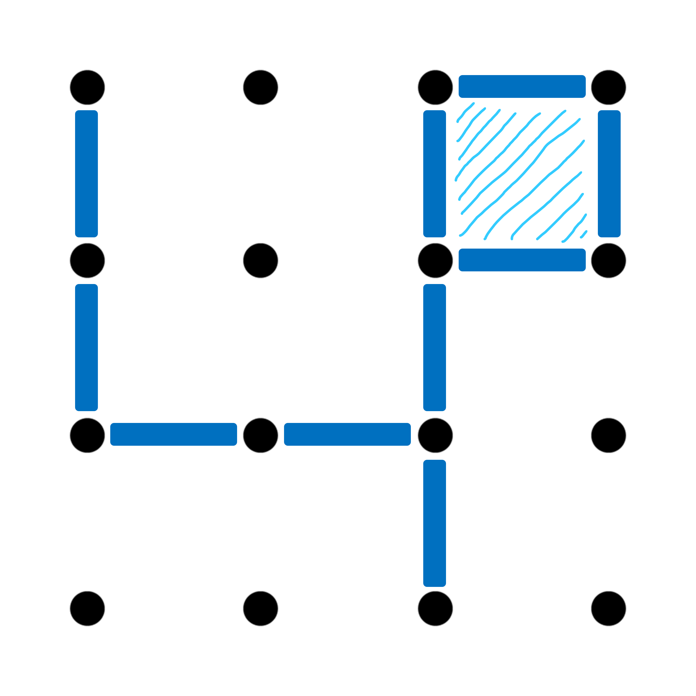
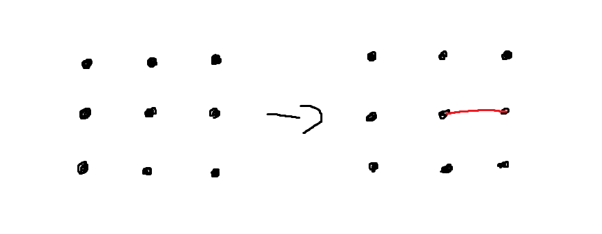
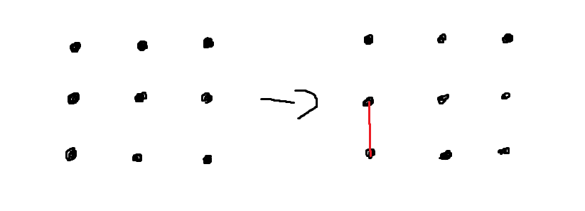

# **Projeto Nº 2:** Época Normal

<hr/>



<hr/>

**Unidade Curricular: Inteligência Artificial**
* **Professor**:
    * Eng. Filipe Mariano

* **Alunos**:
    * João Portas - 202002475
    * Lucas Freixieiro - 202002193

<br>

# **Introdução**
Este projeto passa pela implementação de um jogo Dots and Boxes que vai ter 2 modos de jogo (CPU vs CPU e CPU vs Humano). As jogadas do CPU são escolhidas através do algoritmo alfabeta, que nos dá uma avaliação e o nó de qual a melhor jogada a seguir.

<br>

# **Executar**

Para o desenvolvimento foi utilizado o SBCL com a consola do VSCode.
Se tiver o SBCL instalado é possível correr o projeto com:

```console
sbcl --load .\main.lisp --eval '(in-package #:main)'
```
para executar o programa no geral e poder utilizar funções na consola. De seguida basta escrever (start) na consola e temos o programa a correr.

<br>

# **Arquitetura do sistema**

Para estrutura e organização do trabalhou recorreu-se ao uso de packages do LISP e ficheiros que são referenciados na tabela abaixo. Em cada ficheiro colocou-se um package e deu-se `use` dos necessários para usar as funções precisas.

| Ficheiro | Package | Use |
| --- | :-----------: | :------: |
| **main.lisp** | `main` |  `board` `node` `not-informed-search` <br/> `informed-search` `example-values` <br/> `unit-tests` |
| **board.lisp** | `board` | N/a |
| **node.lisp** | `node` |  `board` |
| **not-informed-search.lisp** | `not-informed-search` | `node` |
| **informed-search.lisp** | `informed-search` | `node` |
| **informed-search.lisp** | `informed-search` | `node` |
| **example-values.lisp** | `example-values` | `node` |
| **unit-tests.lisp** | `unit-tests` | `board` `example-values` |
<br>

##### main.lisp

É onde inicia o sistema e tem as funções que fazem ligação ao projeto todo. Contém a lógica para gerar a UI e guardar ficheiros.

##### board.lisp

Contem a lógica da manipulação dos estados relativamente ao tabuleiro de jogo, como ligar dois pontos, ver quantas caixas estão fechadas entre outras.

##### node.lisp

Contém a lógica para para a manipulação da informação de cada nó, como obter heurísticas, criar um nó, obter o estado que seria o tabuleiro...

##### not-informed-search.lisp

Implementa os algoritmos BFS e DFS e funções de suporte aos mesmos para a execução destes dois dado os parametros recebidos.

##### informed-search.lisp

Implemente o algoritmo A* que recebe uma heurística presente nos nodes.lisp para a execução do algoritmo.

##### example-values.lisp

Possuí funções que retornam os dados estruturados para utilização nos testes na consola para não haver a necessidade de escrever o código diretamente na consola para cada parametro da função a testar-se.

##### unit-tests.lisp

Seria a implementação de código para executar as funções e comparar o output esperado que poderia ser usado individualente para verificar se as funções estão a funcionar corretamente.
O código para estes testes não foi todo implementado pelo que está incompleto.

# **Ficheiros de Dados**

O programa executa as operações sobre os seguintes ficheiros:

| Ficheiro | Operações |
| :--- | :-----------: |
| log.dat | Escrita |

#### log.dat
Guarda a informação relativamente aos problemas que se solicita a resolução. A este vai sendo adicionada a informação conforme se solicita a execução dos algoritmos sobre os problemas a resolver. É possível encontrar este ficheiro na pasta root.

## Tipos Abstrados de Dados

Para o desenvolvimento de uma solução para o problema proposto, foram utilizadas algumas estruturas com listas e funções para trabalhar sobre as mesmas em ficheiros e packages, os quais já referidos anteriormente.

### **Board**

| Ficheiro | Package |
| ---: | :-----------: |
| board.lisp | board |

Definimos um `board`, como uma lista formatada nas seguinte forma:

```lisp
'([Linhas Horizontais] [Linhas Verticais])
```
* Em que `[Linhas Horizontais]` é uma lista que pode ter várias sub-listas e que têm valores numéricos para indicar uma conexão como:
```lisp
'((0 0 0) (0 0 0) (0 0 0) (0 0 0))
```
* O mesmo aplica-se a `[Linhas verticais]`:
```lisp
'((0 0 0) (0 0 0) (0 0 0) (0 0 0))
```
Desta forma teremos uma lista estruturada para `board` que representa um tabuleiro 3x3 da seguinte forma:
```lisp
'(
    ((0 0 0) (0 0 0) (0 0 0) (0 0 0))
    ((0 0 0) (0 0 0) (0 0 0) (0 0 0))
 )
```

### **Funções**

```lisp
(defun draw-horizontal-arc (board row col &optional (x 1))
    ...
)
```
A função `draw-horizontal-arc` recebe um `board`, uma linha e uma coluna e traça uma linha horizontal para a direita a partir desse ponto. Retorna uma `board` que seria a recebida com mais essa linha no caso de ainda não existir uma linha já desenhada onde se indicou. Se não retorna NIL.

Exemplo de uma `board` vazia de 2x2 para `(draw-horizontal-arc board 2 2)`:


```lisp
(defun draw-vertical-arc (board col row &optional (x 1))
    ...
)
```
A função `draw-vertical-arc` recebe um `board`, uma coluna e uma linha e traça uma linhha vertical para baixo a partir desse ponto. Retorna uma `board` que seria a recebida com mais essa linha no caso de ainda não existir uma linha já desenhada onde se indicou. Senão retorna NIL.

Exemplo de uma `board` vazia de 2x2 para `(draw-horizontal-arc board 1 2)`:


```lisp
(defun get-number-of-closed-boxes (board)
    ...
)
```
A função `get-number-of-closed-boxes` recebe um `board` e retorna quantas caixas existem fechadas nessa board.

### node

| Ficheiro | Package |
| ---: | :-----------: |
| node.lisp | node |

Defenimos um `node` como uma lista formatada nas seguinte forma:

```lisp
'([Tabuleiro] [Profundidade] [?Avaliação Heurística] [Nó pai])
```

* Em que o `[Tabuleiro]` representa um `board`.
* A `[Profundidade]` o nível de profundidade de um nó na árvore (ex. o nó raiz tem profundidade 0 e os seus sucessores +1 que a do seu nó pai que é a raiz).
* A `[?Avaliação Heurística?]` que é opcional e deverá apenas existir no caso do uso de algoritmos de pesquisa informados.
* E o `[Nó Pai]` que representa um outo `node` e será o nó pai (ou antecessor) e que poderá ser NIL no caso de ser um nó de profundidade 0 que seria a raiz.

##### Funções

```lisp
(defun new-successor (board depth parent &optional heuristic)
    ...
)
```
Para criarmos um `node` podemos utilizar a função `new-successor` que recebe um `board` uma profundidade (um número inteiro) o nó pai que será outro `node` ou NIL se não existir. Opcionalmente e para o uso em algoritmos de pesquisa informada passamos o campo `&optional` heuristic que será o valor heuristico do nó.
Esta irá retornar uma lista que irá representar um `node`.

```lisp
(defun get-node-state (node)
    ...
)
```
A função `get-node-state` que nos retorna o `[Tabuleiro]` que é uma `board` de um nó que seria o estado do tabuleiro.

```lisp
(defun get-node-depth (node)
    ...
)
```
A função `get-node-depth` retorna o valor em `[Profundidade]` que é um número inteiro.

```lisp
(defun get-node-parent (node)
    ...
)
```
A função `get-node-depth` retorna o valor em `[Nó pai]` que é um `node`.

```lisp
(defun get-node-heuristic (node)
    ...
)
```
A função `get-node-depth` retorna o valor em `[?Avaliação Heurística]` se existir, senão retorna NIL.


## Implementação dos Algoritmos

Nota: Para o número de nós que cada algoritmo gera não está a ser contabilizado o nó inicial.

### BFS

O algoritmo BFS é implementado no ficheiro `not-informed-search.lisp` em é chamado através da função:
```lisp
(defun bfs-init (start-board closed-boxes-objective)
    ...
)
```
Esta função recebe como parametros `board` que será o estado inicial e o número de caixas que têm de estar fechadas como estado final.

Depois esta função cria o `node` que vai ser colocado na lista de abertos assim iniciando o ciclo do BFS com a função seguinte:
```lisp
(defun bfs (closed-boxes-objective OPEN-LIST &optional CLOSED-LIST
    (number-of-generated-nodes 0)
    (number-of-expanded-nodes 0))
    ...
)
```
Esta função tem como parametros:
* closed-boxes-objective:
    * Utilizado para verificar se os `node` gerados têm uma quantidade de caixas fechadas maior ou igual ao parametro para determinar se algum é o `node` solução.
* OPEN-LIST:
    * Para manter um registo dos `node` que ainda não foram expandidos. Se esta lista for vaiza o algoritmo termina pois não existem mais `node` para expandir.
* CLOSED-LIST:
    * Um campo opcional que é defenido posteriormente no algoritmo para guardar os `node` que já foram expandidos por forma a evitar gerar novos `node` com o mesmo estado, ou seja `board`.
* number-of-generated-nodes:
    * Opcional e que deverá ser 0 no início para manter um registo do número de nós gerados para o cálculo da ramificação e penetrância.
* number-of-expanded-nodes
    * Opcional e que deverá ser 0 no início para manter um registo do número de nós que foram expandidos para o cálculo da ramificação.

<!--Abaixo encontra-se a implementação completa da função:-->

A função é recursiva em que as suas condições de paragem são:
* Se a lista OPEN-LIST é NIL, pois não há mais nós para expandir
* Se um dos nós sucessores tem um número de caixas fechadas às recebidas por parametro.

Como retorno a funções retorna uma lista com o formato:
```lisp
'(([Nó solução]) [Qtn nós gerados] [Qtn nós expandidos] [Fator ramificação] [Penetrância])
```
em que:
* `[Nó solução]` é o nó objetivo (o que tem o número de caixas fechadas). Se não encontrar a solução este campo será NIL.
* `[Qtn nós gerados]` com a quantidade de nós gerados ao todo pelo algoritmo.
* `[Qtn nós expandidos] ` com a quantidade de nós que foram expandidos.
* `[Fator ramificação]` com o valor do fator de ramificação do algoritmo.
* `[Penetrância]` com o valor da penetrância do algoritmo. Se não encontrar a solução este campo será NIL.

### DFS

O algoritmo DFS é implementado no ficheiro `not-informed-search.lisp` e é chamado através da função:
```lisp
(defun dfs-init (start-board closed-boxes-objective max-depth)
    ...
)
```
Esta função recebe como parametros `board` que será o estado inicial e o número de caixas que têm de estar fechadas como estado final e o máximo de profundidade da pesquisa.

Depois esta função cria o `node` que vai ser colocado na lista de abertos assim iniciando o ciclo do DFS com a função seguinte:
```lisp
(defun dfs (closed-boxes-objective max-depth OPEN-LIST &optional
    CLOSED-LIST
    (number-of-generated-nodes 0)
    (number-of-expanded-nodes 0))
    ...
)
```
Esta função tem como parametros:
* closed-boxes-objective:
    * Utilizado para verificar se os `node` gerados têm uma quantidade de caixas fechadas maior ou igual ao parametro para determinar se algum é o `node` solução.
* OPEN-LIST:
    * Para manter um registo dos `node` que ainda não foram expandidos. Se esta lista for vaiza o algoritmo termina pois não existem mais `node` para expandir.
* max-depth:
    * Utilizado para limitar a profundidade durante a pesquisa.
* CLOSED-LIST:
    * Um campo opcional que é defenido posteriormente no algoritmo para guardar os `node` que já foram expandidos por forma a evitar gerar novos `node` com o mesmo estado, ou seja `board`.
* number-of-generated-nodes:
    * Opcional e que deverá ser 0 no início para manter um registo do número de nós gerados para o cálculo da ramificação e penetrância.
* number-of-expanded-nodes
    * Opcional e que deverá ser 0 no início para manter um registo do número de nós que foram expandidos para o cálculo da ramificação.

<!--Abaixo encontra-se a implementação completa da função:-->

A função é recursiva em que as suas condições de paragem são:
* Se a lista OPEN-LIST é NIL, pois não há mais nós para expandir
* Se um dos nós sucessores tem um número de caixas fechadas às recebidas por parametro.

Como retorno a funções retorna uma lista com o formato:
```lisp
'(([Nó solução]) [Qtn nós gerados] [Qtn nós expandidos] [Fator ramificação] [Penetrância])
```
em que:
* `[Nó solução]` é o nó objetivo (o que tem o número de caixas fechadas). Se não encontrar a solução este campo será NIL.
* `[Qtn nós gerados]` com a quantidade de nós gerados ao todo pelo algoritmo.
* `[Qtn nós expandidos] ` com a quantidade de nós que foram expandidos.
* `[Fator ramificação]` com o valor do fator de ramificação do algoritmo.
* `[Penetrância]` com o valor da penetrância do algoritmo. Se não encontrar a solução este campo será NIL.

### A*

O algoritmo A* é implementado no ficheiro `informed-search.lisp` e é chamado através da função:
```lisp
(defun a-star-init (start-board closed-boxes-objective fn-heuristic &rest rest)
    ...
)
```
Esta função recebe como parametros `board` que será o estado inicial e o número de caixas que têm de estar fechadas como estado final, a heurística de avaliação e os parametros para a heurística escolhida.

As heurísticas possíveis estão no ficheiro `node.lisp` e são:
```lisp

(defun heuristic-eval-by-remaining-to-close (board objective-close-squares)
    ...
)

(defun heuristic-eval-by-remaining-arcs (board)
    ...
)
```

Para passar a heurística de avaliação pretendida apenas é necessário passar a partir do segundo parametro se existir, ao seja para o caso da função de avaliação heurística `heuristic-eval-by-remaining-to-close` poderiamos chamar a função como:
```lisp
(a-star-init start-board closed-boxes-objective 'heuristic-eval-by-remaining-to-close 5)
```
que assim passaria-se a função heuristica o parametro que requer o qual é enviado através do &rest da função.
Já para a `heuristic-eval-by-remaining-arcs` podemos fazer igual mas passando-a sem indicar paramêtros pois a mesma não os recebe.
```lisp
(a-star-init start-board closed-boxes-objective 'heuristic-eval-by-remaining-arcs)
```

Depois esta função cria o `node` que vai ser colocado na lista de abertos assim iniciando o ciclo do A* com a função seguinte:
```lisp
(defun a-star (fn-heuristic closed-boxes-objective OPEN-LIST &optional
    CLOSED-LIST
    (number-of-generated-nodes 0)
    (number-of-expanded-nodes 0)
    &rest rest)
    ...
)
```
Esta função tem como parametros:
* fn-heuristic:
    * Simbolo da função heurística a utilizar. É possível usar uma das heurísticas presentes no ficheiro `node.lisp`.
* closed-boxes-objective:
    * Utilizado para verificar se os `node` gerados têm uma quantidade de caixas fechadas maior ou igual ao parametro para determinar se algum é o `node` solução.
* OPEN-LIST:
    * Para manter um registo dos `node` que ainda não foram expandidos. Se esta lista for vaiza o algoritmo termina pois não existem mais `node` para expandir. Os nós são substituíveis no caso de um sucessor com o mesmo estado ter melhor avaliação heurística.
* CLOSED-LIST:
    * Um campo opcional que é defenido posteriormente no algoritmo para guardar os `node` que já foram expandidos por forma a evitar gerar novos `node` com o mesmo estado, ou seja `board`. Os nós podem ser removidos no caso de um sucessor com o mesmo estado ter melhor avaliação heurística.
* number-of-generated-nodes:
    * Opcional e que deverá ser 0 no início para manter um registo do número de nós gerados para o cálculo da ramificação e penetrância.
* number-of-expanded-nodes
    * Opcional e que deverá ser 0 no início para manter um registo do número de nós que foram expandidos para o cálculo da ramificação.
* rest:
    * Parametros a serem passados para a função de avaliação heurística.

<!--Abaixo encontra-se a implementação completa da função:-->

A função é recursiva em que as suas condições de paragem são:
* Se a lista OPEN-LIST é NIL, pois não há mais nós para expandir
* Se um dos nós sucessores tem um número de caixas fechadas às recebidas por parametro.

Como retorno a funções retorna uma lista com o formato:
```lisp
'(([Nó solução]) [Qtn nós gerados] [Qtn nós expandidos] [Fator ramificação] [Penetrância])
```
em que:
* `[Nó solução]` é o nó objetivo (o que tem o número de caixas fechadas). Se não encontrar a solução este campo será NIL.
* `[Qtn nós gerados]` com a quantidade de nós gerados ao todo pelo algoritmo.
* `[Qtn nós expandidos] ` com a quantidade de nós que foram expandidos.
* `[Fator ramificação]` com o valor do fator de ramificação do algoritmo.
* `[Penetrância]` com o valor da penetrância do algoritmo. Se não encontrar a solução este campo será NIL.

## Melhorias
* Há a necessidade de fazer refactoring no código pois existem funções que fazem a mesma coisa ou muito semelhante duplicadas nos packages dos diferentes tipos de procura.
* Criar mais funções para reduzir a quantidade de código dentro das funções dos algoritmos de procura, como por exemplo poderia se criar uma função para calcular a penetrância e outra para o fator de ramificação geral a todos.
* Melhor a modularidade de passar uma função de avaliação heurística para a função do A* de forma a não ser necessáro tela no package `node.lisp`.
* Implementar a heurística h(x) = td(x) - dc(x) em que o td(x) (total dots) seria o total de pontos do tabuleiro e dc(x) (double connected) a quantidade de pontos em que nesse ponto coêncide 2 ou mais linhas (2 ou mais conecxões). 

## Limitações

* Modularidade da função heurística fraca e confusa.

## Requisitos Não Implementados

* Algoritmo SMA*
* Algoritmo IDA*
* Algoritmo RBFS